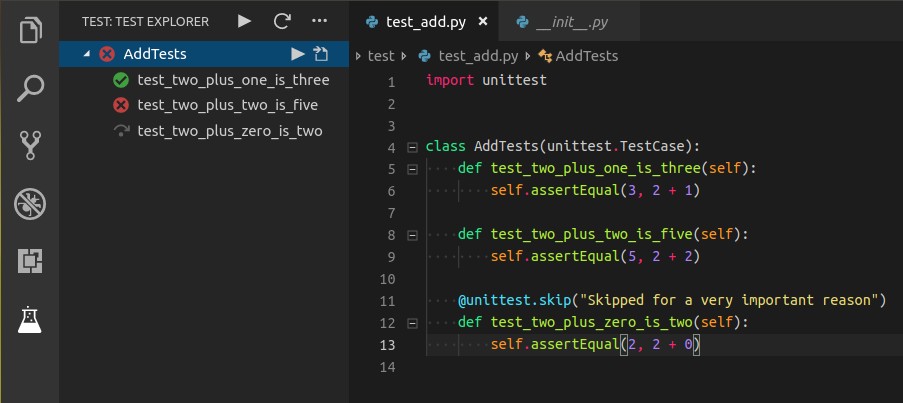

# Python Test Explorer for Visual Studio Code

[](https://github.com/kondratyev-nv/vscode-python-test-adapter/actions?query=workflow%3A%22GitHub+Actions+CI%22+branch%3Amaster)
[](https://dev.azure.com/kondratyev-nv/Python%20Test%20Explorer%20for%20Visual%20Studio%20Code/_build/latest?definitionId=1&branchName=master)
[](https://david-dm.org/kondratyev-nv/vscode-python-unittest-adapter)

This extension allows you to run your Python [Unittest](https://docs.python.org/3/library/unittest.html#module-unittest)
or [Pytest](https://docs.pytest.org/en/latest/)
tests with the [Test Explorer UI](https://marketplace.visualstudio.com/items?itemName=hbenl.vscode-test-explorer).



## Getting started

* Install the extension
* Configure Visual Studio Code to discover your tests
  (see [Configuration section](#configuration) and documentation of a test framework of your choice
  ([Unittest documentation](https://docs.python.org/3/library/unittest.html#module-unittest),
   [Pytest](https://docs.pytest.org/en/latest/getting-started.html))
* Open Test View sidebar
* Run your tests using the  icon in the Test Explorer

## Features

* Shows a Test Explorer in the Test view in VS Code's sidebar with all detected tests and suites and their state
* Convenient error reporting during test discovery
* Unittest and Pytest debugging
* Shows a failed test's log when the test is selected in the explorer
* Supports multi-root workspaces
* Supports Unittest and Pytest test frameworks and their plugins

## Comparison to Python extension's Test View

* Better error reporting during the discovery stage. In case of errors, you will see such tests in an errored state, and by clicking on them, a complete error message would be shown in the Output panel. Python Extension, at best, won't show your tests that contain errors (syntax errors and invalid imports, for example).
* Works better with pytest plugins - Tavern, for example. Python Extension won't discover these tests.
* Based on [Test Explorer UI](https://marketplace.visualstudio.com/items?itemName=hbenl.vscode-test-explorer). This fact may be useful if you have a workspace with projects in different languages/frameworks. Test Explorer UI has a lot of plugins, and you can conveniently discover and run tests at the same View.
* Shows you errors and a complete output of your tests just by clicking on a failed test.
* Shows only relevant folders from your workspace. Showing all workspace folders, as the Python Extension is doing, can be an issue when you have multiple workspace folders, but only a couple of them have any tests.
* There might be some configurations when this extension will discover and run your tests, but Python Extension - won't.
* User experience with both extensions is highly subjective. However, you might like the user interface of this extension better. Also, each discovery, test execution, and test cancellation won't require you to select a folder when you have multiple in your workspace.

## Configuration

By default the extension uses the configuration from [Python extension for Visual Studio Code](https://marketplace.visualstudio.com/items?itemName=ms-python.python).
To configure Python for your project see [Getting Started with Python in VS Code](https://code.visualstudio.com/docs/python/python-tutorial).

However, test framework used by this extension can be overridden by `pythonTestExplorer.testFramework` configuration property.
Right now, the two available option are `unittest` and `pytest`. When property is set to `null`, the configuration from Python extension is used.

### Configuring Python test discovery and execution

List of currently used properties:

Property                                       | Description
-----------------------------------------------|---------------------------------------------------------------
`python.pythonPath`                            | Path to Python.
`python.envFile`                               | Path to environment variable definitions file.
`python.testing.cwd`                           | Optional working directory for unit tests.
`python.testing.unittestEnabled`               | Whether to enable or disable unit testing using unittest (enables or disables test discovery for Test Explorer).
`python.testing.unittestArgs`                  | Arguments used for test discovery (currently only `-s` and `-p` arguments are considered).
`python.testing.pyTestEnabled`                 | Whether to enable or disable unit testing using pytest (enables or disables test discovery for Test Explorer).
`python.testing.pytestPath`                    | Path to pytest executable or a pytest compatible module.
`python.testing.pyTestArgs`                    | Arguments passed to the pytest. Each argument is a separate item in the array.
`python.testing.autoTestDiscoverOnSaveEnabled` | When `true` tests will be automatically rediscovered when saving a test file.
`pythonTestExplorer.testFramework`             | Test framework to use (overrides Python extension properties `python.testing.unittestEnabled` and `python.testing.pyTestEnabled`).

Configuration supports placeholders for workspace folder as `${workspaceFolder}` and environment variables in a form of `${env:YOUR_ENVIRONMENT_VARIABLE}`.

### Configuring Test Explorer UI

The following configuration properties are provided by [Test Explorer UI](https://marketplace.visualstudio.com/items?itemName=hbenl.vscode-test-explorer):

Property                              | Description
--------------------------------------|---------------------------------------------------------------
`testExplorer.onStart`                | Retire or reset all test states whenever a test run is started
`testExplorer.onReload`               | Retire or reset all test states whenever the test tree is reloaded
`testExplorer.codeLens`               | Show a CodeLens above each test or suite for running or debugging the tests
`testExplorer.gutterDecoration`       | Show the state of each test in the editor using Gutter Decorations
`testExplorer.errorDecoration`        | Show error messages from test failures as decorations in the editor
`testExplorer.errorDecorationHover`   | Provide hover messages for the error decorations in the editor
`testExplorer.sort`                   | Sort the tests and suites by label or location. If this is not set (or set to null), they will be shown in the order that they were received from the adapter
`testExplorer.showCollapseButton`     | Show a button for collapsing the nodes of the test tree
`testExplorer.showExpandButton`       | Show a button for expanding the top nodes of the test tree, recursively for the given number of levels
`testExplorer.showOnRun`              | Switch to the Test Explorer view whenever a test run is started
`testExplorer.addToEditorContextMenu` | Add menu items for running and debugging the tests in the current file to the editor context menu
`testExplorer.mergeSuites`            | Merge suites with the same label and parent
`testExplorer.hideEmptyLog`           | Hide the output channel used to show a test's log when the user clicks on a test whose log is empty
`testExplorer.hideWhen`               | Hide the Test Explorer when no test adapters have been registered or when no tests have been found by the registered adapters. The default is to never hide the Test Explorer (some test adapters only work with this default setting).

See [Test Explorer UI](https://marketplace.visualstudio.com/items?itemName=hbenl.vscode-test-explorer) documentation for the latest changes in configuration.

### Configuring debug

The extension will look for a configuration in launch.json with `"type": "python"` and `"request": "test"` to load any of the following options during debugging

* name
* console
* env
* stopOnEntry
* showReturnValue
* redirectOutput
* debugStdLib
* justMyCode
* subProcess
* envFile

For example,

```json
{
    "version": "0.2.0",
    "configurations": [
        {
            "name": "Debug test",
            "type": "python",
            "request": "test",
            "console": "externalTerminal",
            "justMyCode": false,
            "stopOnEntry": true,
            "envFile": "${workspaceFolder}/.env.test",
        }
    ]
}
```

## Troubleshooting

Whether no tests were discovered in the Test Explorer view or anything else doesn't work as expected, you can see logging output selecting `Python Test Adapter Log` in the Output section.

## Questions, issues, feature requests, and contributions

* If you're happy using this extension - star [GitHub repo](https://github.com/kondratyev-nv/vscode-python-test-adapter) and [share your positive feedback in VSCode Marketplace](https://marketplace.visualstudio.com/items?itemName=LittleFoxTeam.vscode-python-test-adapter&ssr=false#review-details).
* If you have any question or a problem with the extension, please [file an issue](https://github.com/kondratyev-nv/vscode-python-test-adapter/issues).
* Contributions are always welcome! Please see [contributing guide](CONTRIBUTING.md) for more details.
